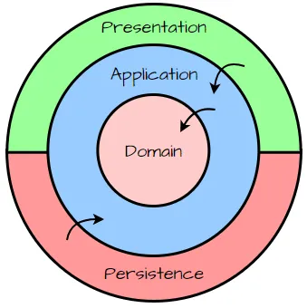

# __TEMPLATE_PROJECT_NAME__


# Getting Started
Remember to enable KubKubernetes on rancher before start

## Local Environment setup
Choose your way to setup your machine Automated or Manual

### Automated Setup
```shell
chmod +x ./runGetStartedProjectSetup.sh
./runGetStartedProjectSetup.sh
```
Wait for the message "Ready to develop"

### Manual Setup
<details>
<summary>Gentoo / Epic developer style? Manual instructions here</summary>

### Step 1: Pull down this repo, then immediately make a python virtual environment for that repo.

```shell
uv python install 3.11.9
uv venv --python 3.11.9
uv python pin 3.11.9
uv lock
uv sync
```

This should create a folder and a file:

`.venv` -> Where all your deps are installed.

`/.python-version` with the contents `3.11.9` -> which tells `uv` what virtual environment to use when in this directory.

</details>
<BR><BR>

## Run
Choose your way to develop local, use one of the below options:
<details>
<summary> Docker Launcher</summary>

Start your Docker

run `sh runDocker.sh`
</details>

---

<details>
<summary>Uvicorn(FastAPI) Launcher</summary>

This should start your project locally with hot reload enabled.
```shell
sh runDocker.sh -d
uv run python -m uvicorn --app-dir src/app __init__:app --lifespan on --reload --host 0.0.0.0 --port 8085
```
</details>

---

<details>
<summary> Skaffold(Minikube) Launcher</summary>
<BR>
Run

```shell
minikube start
skaffold build
skaffold dev
minikube tunnel
```

PS: The minikube tunnel needs to be run in another terminal tab.

</details>

---
<BR><BR>

<details>
<summary> Want more details about the runDocker Scripts?</summary>

run `sh runDocker.sh -h`
</details>

---
<BR><BR>

## API access and swagger
After application is running:

run `curl -X 'GET' 'http://localhost:8085/__TEMPLATE_PROJECT_NAME__/api/v1/health' -H 'accept: application/json'`

or

Visit: [ http://localhost:8085/__TEMPLATE_PROJECT_NAME__/api/v1/docs]( http://localhost:8085/__TEMPLATE_PROJECT_NAME__/api/v1/docs) to see the auto generated swagger docs and muck around with it a bit.

<BR><BR>

# Architecture



The files in this repository aren't strictly organized by layer==folder structure, but they do follow a strictly follow the above pattern for their imports. One of the fundamental ideas is that you should be able to pull any given presentation layer off the top and replace it with another one without having to change any of the code below it.
The typical example is that you can pull the presentation layer (fastapi) off and replace it with unit tests, however a better example might be pull the fastapi presentation layer off and replace it with a message queue or an ETL process or dagster or even another different fastapi app for backoffice that might use a different auth schema, or a service to service RPC presentation layer.

Keep those considerations in mind as you look through the code.

Presentation Layer:
* app/__init__.py -> App setup and startup.
* app/api.py      -> FastAPI Controllers
* app/config.py   -> IoC configuration
* app/schemas.py  -> External schemas and mapping to application and domain.

Persistence Layer:
* app/dal.py      -> Data access layer.

Application Layer:
* app/service.py  -> Services and use cases.

Domain Layer:
* app/models.py   -> Domain models and business logic.


# HPA is on experiment mode - please dont use yet
<details>
<summary> pending topics</summary>

note: k8s need metric-service be active
Open Question: should we go this route? Should we have metrics per namespace/service?
note: unncomment the skaffold yaml line "deployment/k8s/hpa/*.yaml #Experimental Only"
```
minikube addons enable metrics-server
minikube addons enable ingress-dns
minikube addons enable ingress
add host to /etc/hosts
-+-HPA not scaling
--https not working
kubectl apply -f https://github.com/kubernetes-sigs/metrics-server/releases/latest/download/components.yaml
```

</details>